# 功能完成列表

## load 文件路径

完成状态：完成

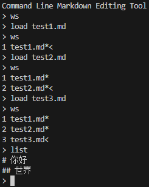

## save

完成状态：完成

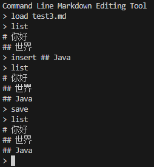

## ws

完成状态：完成

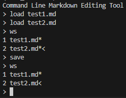

## switch 文件序号

完成状态：完成

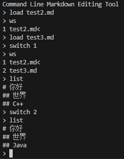

## close 文件序号

完成状态：完成

## insert [⾏号] 标题/文本

完成状态：完成

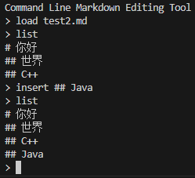

## append-head 标题/文本

完成状态：完成

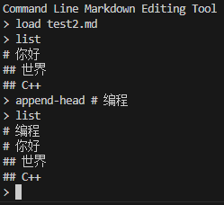

## append-tail 标题/文本

完成状态：完成

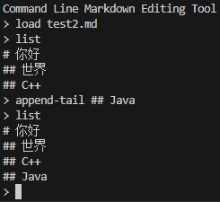

## delete 标题/文本 或 delete ⾏号

完成状态：完成

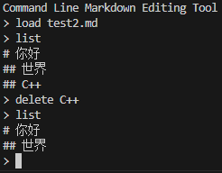

## undo

完成状态：完成

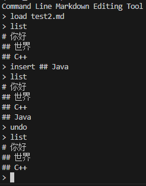

## redo

完成状态：完成

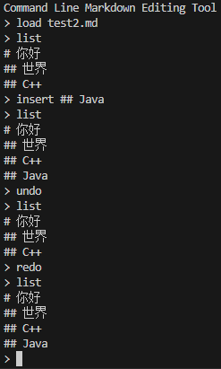

## list

完成状态：完成

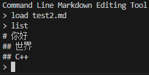

## list-tree

完成状态：完成

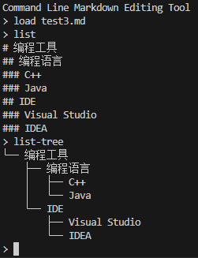

## dir-tree [⽬录]

完成状态：完成

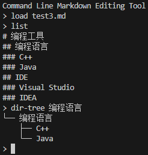

## history [数量]

完成状态：完成

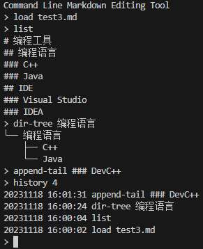

## stats [all | current]

完成状态：完成

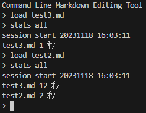
